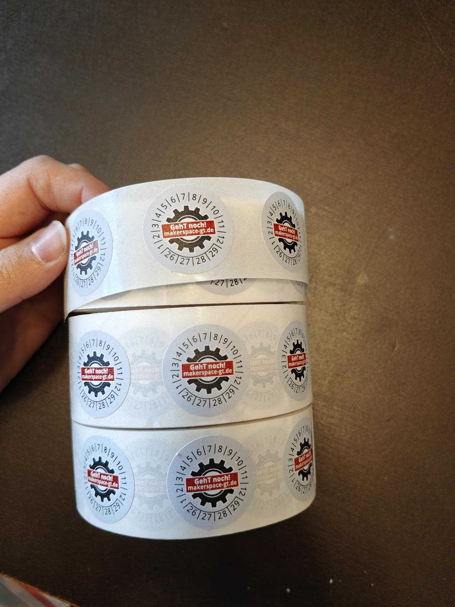

# GehT-weiter-fund

## Kurzbeschreibung Vorhaben

Wir wollen die Werkzeugausstattung für unser Repair Café verbessern. Anfangs hatten wir unsere Vereinsräume ebenfalls in der Stadtbibliothek Gütersloh, sind diesen aber Ende 2019, entwachsen und in das Kulturzentrum »Die Weberei« umgezogen. Seitdem müssen wir für jedes Repair Café Werkzeuge aus unserem Makerspace einpacken und in die Bibliothek transportieren. Vor allem seit die Veranstaltungen nach Corona wieder uneingeschränkt möglich sind, haben wir das als große Motivationsbremse empfunden. Das Einpacken, der Transport und der Aufbau in der Stadtbibliothek dauert ca. 45 Minuten, muss am Ende des Termins noch einmal gemacht werden und wird meistens von den beiden Personen, die das Repair Café organisieren, erledigt. Nicht zuletzt führt der häufige Transport der Werkzeuge immer wieder zu Unordnung in unserer Werkstatt und dazu, dass nicht immer alle Werkzeuge dabei sind. Mit den im Kostenplan aufgeführten investiven Maßnahmen können wir das Werkzeug dauerhaft am Ort des Repair Café lagern und mehr Zeit für das Reparieren selbst verwenden.

## Kostenplan

| Investive Maßnahme                                                    |                |
| :-------------------------------------------------------------------- | -------------: |
| Allgemeines (Spendendose, Flyer, Sticker, Handy, Beschriftungsgerät)  |       364,10 € |
| Kleber (detaillierte Aufstellung vorhanden)                           |        37,45 € |
| Messwerkzeuge (detaillierte Aufstellung vorhanden)                    |        48,56 € |
| Elektronikwerkzeuge (detaillierte Aufstellung vorhanden)              |     1.220,85 € |
| Textilwerkzeuge (detaillierte Aufstellung vorhanden)                  |        47,84 € |
| Fahrradwerkzeuge (detaillierte Aufstellung vorhanden)                 |       129,61 € |
| allgemeine mechanische Werkzeuge (detaillierte Aufstellung vorhanden) |     1.136,24 € |
| Action Cam zur Dokumentation                                          |        78,98 € |
| diverse Reinigungsmittel (detaillierte Aufstellung vorhanden)         |       111,77 € |
|                                                                       | **3.175,40 €** |
|                                                                       |                |
| Kosten gesamt                                                         | **3.175,40 €** |
|                                                                       |                |
| Maximaler Förderbetrag                                                |     3.000,00 € |

## Einverständniserklärungen

- [x] Mit der zu bewilligende Maßnahme wurde noch nicht begonnen und wird auch nicht vor Erhalt des Bewilligungsbescheides begonnen.
- [x] Die zugrundeliegende Förderrichtlinie habe ich/haben wir zur Kenntnis genommen.
- [x] Mit der Einreichung erkläre ich mein Einverständnis, dass vorstehende Daten erhoben und elektronisch gespeichert werden, sowie das Einverständnis betroffener Dritter dazu eingeholt zu haben.  
      *Die Erhebung, Verarbeitung und Nutzung vorstehender personenbezogener Daten sind nur zulässig, wenn der Betroffene (Antragsteller) eingewilligt hat. Für den Fall, dass hierzu die Einwilligung verweigert wird, kann der Antrag nicht bearbeitet und die beantragte Förderung damit nicht bewilligt werden.*

# Verwendungsnachweis für Förderantrag

## Sachbericht
(250 bis 1500 Zeichen)

Der Sachbericht ist ein von euch zu erstellender Text von minimal 250 und maximal 1500 Zeichen Länge. Bitte beschreibt, wie die Umsetzung des im Antrag formulierten Projektes verlaufen ist. Als inhaltliche Anregung orientiert euch gerne an den Fragen des Mini-Fragebogens.

## Belegliste

| Ausgabenbereich    | Zahlungsgrund/Gegenstand/Maßnahme                     | Zahlungsempfänger*in                                 | Belegart               | Zahlungsdatum | Belegnummer |    Summe |
| ------------------ | ----------------------------------------------------- | ---------------------------------------------------- | ---------------------- | ------------- | :---------: | -------: |
| Investive Maßnahme | Allgemein: Geldtasche                                 | Marcus Eikamp                                        | Rechnung + Kontoauszug | 13.05.2025    |      1      |   4,80 € |
| Investive Maßnahme | Allgemein: Namesschilder                              | STANILA FOYA SHOP S.R.L.                             | Rechnung + Kontoauszug | 11.04.2025    |      2      |  25,63 € |
| Investive Maßnahme | Allgemein: Handy                                      | BRIDGE NINE OY                                       | Rechnung + Kontoauszug | 09.04.2025    |      5      | 181,99 € |
| Investive Maßnahme | Allgemein: Beschriftungsgerät                         | Proshop a/s                                          | Rechnung + Kontoauszug | 09.04.2025    |      6      |  81,84 € |
| Investive Maßnahme | Kleben: 2K-Kleber                                     | Adam Bober                                           | Rechnung + Kontoauszug | 09.04.2025    |      7      |  15,50 € |
| Investive Maßnahme | Kleben: Heißklebepistole                              | Amazon Business EU SARL                              | Rechnung + Kontoauszug | 09.04.2025    |      8      |  29,64 € |
| Investive Maßnahme | Kleben: Heißklebesticks                               | MIRROR COARE MARIN S.R.L.                            | Rechnung + Kontoauszug | 11.04.2025    |      9      |   6,07 € |
| Investive Maßnahme | Messen: IR Thermometer                                | Amazon Business EU SARL                              | Rechnung + Kontoauszug | 09.04.2025    |     10      |  21,99 € |
| Investive Maßnahme | Messen: Maßband                                       | Amazon Business EU SARL                              | Rechnung + Kontoauszug | 11.04.2025    |     11      |   7,04 € |
| Investive Maßnahme | Elektr(on)ik: Dritter Hand mit Lupe und Licht         | Amazon Business EU SARL                              | Rechnung + Kontoauszug | 11.04.2025    |     12      |  35,14 € |
| Investive Maßnahme | Elektr(on)ik: Elektronik Seitenschenider              | FERSYS GmbH                                          | Rechnung + Kontoauszug | 11.04.2025    |     13      |  15,01 € |
| Investive Maßnahme | Elektr(on)ik: Kontaktreiniger                         | RE-INvent Retail GmbH                                | Rechnung + Kontoauszug | 11.04.2025    |     14      |  10,89 € |
| Investive Maßnahme | Elektr(on)ik: Leiterplattenreiniger                   | RE-INvent Retail GmbH                                | Rechnung + Kontoauszug | 11.04.2025    |     15      |   8,20 € |
| Investive Maßnahme | Elektr(on)ik: Isolier- und Schutzlack                 | RE-INvent Retail GmbH                                | Rechnung + Kontoauszug | 11.04.2025    |     16      |   9,06 € |
| Investive Maßnahme | Elektr(on)ik: Verdrahtungszange                       | FERSYS GmbH                                          | Rechnung + Kontoauszug | 11.04.2025    |     17      |  55,69 € |
| Investive Maßnahme | Elektr(on)ik: Abisolierzange, automatisch             | FERSYS GmbH                                          | Rechnung + Kontoauszug | 11.04.2025    |     18      |  28,17 € |
| Investive Maßnahme | Elektr(on)ik: Aderendhülsenzange                      | FERSYS GmbH                                          | Rechnung + Kontoauszug | 11.04.2025    |     19      | 116,11 € |
| Investive Maßnahme | Elektr(on)ik: Aderendhülsen                           | RE-INvent Retail GmbH                                | Rechnung + Kontoauszug | 11.04.2025    |     20      |  18,06 € |
| Investive Maßnahme | Elektr(on)ik: Aderendhülsen, unisoliert               | RE-INvent Retail GmbH                                | Rechnung + Kontoauszug | 11.04.2025    |     21      |  32,27 € |
| Investive Maßnahme | Elektr(on)ik: Aderendhülsen, Twin                     | RE-INvent Retail GmbH                                | Rechnung + Kontoauszug | 11.04.2025    |     22      |  18,14 € |
| Investive Maßnahme | Elektr(on)ik: Seitenscheider                          | FERSYS GmbH                                          | Rechnung + Kontoauszug | 11.04.2025    |     23      |  22,31 € |
| Investive Maßnahme | Elektr(on)ik: Entmanteler                             | FERSYS GmbH                                          | Rechnung + Kontoauszug | 11.04.2025    |     24      |  29,50 € |
| Investive Maßnahme | Elektr(on)ik: Abisolierzange                          | FERSYS GmbH                                          | Rechnung + Kontoauszug | 11.04.2025    |     25      |  16,33 € |
| Investive Maßnahme | Elektr(on)ik: Crimpzange                              | FERSYS GmbH                                          | Rechnung + Kontoauszug | 11.04.2025    |     26      |  75,73 € |
| Investive Maßnahme | Elektr(on)ik: Kabelschuhe                             | Amazon Business EU SARL                              | Rechnung + Kontoauszug | 11.04.2025    |     27      |   7,49 € |
| Investive Maßnahme | Elektr(on)ik: WAGO Klemmen 2 Leiter                   | Amazon Business EU SARL                              | Rechnung + Kontoauszug | 23.04.2025    |     28      |  20,38 € |
| Investive Maßnahme | Elektr(on)ik: WAGO Klemmen 3 Leiter                   | Voltking GmbH                                        | Rechnung + Kontoauszug | 09.04.2025    |     29      |  19,96 € |
| Investive Maßnahme | Elektr(on)ik: WAGO Klemmen 5 Leiter                   | Amazon Business EU SARL                              | Rechnung + Kontoauszug | 09.04.2025    |     30      |  24,18 € |
| Investive Maßnahme | Elektr(on)ik: Lüsterklemmen                           | Amazon Business EU SARL                              | Rechnung + Kontoauszug | 11.04.2025    |     31      |   4,54 € |
| Investive Maßnahme | Elektr(on)ik: Duspol Spannungsprüfer                  | RE-INvent Retail GmbH                                | Rechnung + Kontoauszug | 11.04.2025    |     32      |  83,94 € |
| Investive Maßnahme | Elektr(on)ik: Berührungsloser Spannungsprüfer         | PeakTech GmbH                                        | Rechnung + Kontoauszug | 11.04.2025    |     33      |  32,24 € |
| Investive Maßnahme | Elektr(on)ik: Multimeter                              | Amazon Business EU SARL                              | Rechnung + Kontoauszug | 11.04.2025    |     34      |  95,08 € |
| Investive Maßnahme | Elektr(on)ik: Oszilloskop Multimeter                  | Amazon Business EU SARL                              | Rechnung + Kontoauszug | 11.04.2025    |     35      |  69,59 € |
| Investive Maßnahme | Elektr(on)ik: Messleitungen                           | Amazon Business EU SARL                              | Rechnung + Kontoauszug | 11.04.2025    |     36      |  43,99 € |
| Investive Maßnahme | Elektr(on)ik: Multifunktionstester                    | Amazon Business EU SARL                              | Rechnung + Kontoauszug | 15.04.2025    |     37      |  18,99 € |
| Investive Maßnahme | Elektr(on)ik: Kabelbinder                             | Amazon Business EU SARL                              | Rechnung + Kontoauszug | 11.04.2025    |     38      |   9,98 € |
| Investive Maßnahme | Elektr(on)ik: Feinsicherungen                         | Amazon Business EU SARL                              | Rechnung + Kontoauszug | 11.04.2025    |     39      |   9,98 € |
| Investive Maßnahme | Elektr(on)ik: Thermosicherungen                       | Amazon Business EU SARL                              | Rechnung + Kontoauszug | 11.04.2025    |     40      |  12,99 € |
| Investive Maßnahme | Elektr(on)ik: Quetschverbinder                        | Alfred Striegel GmbH & Co. KG                        | Rechnung + Kontoauszug | 09.04.2025    |     41      |  27,66 € |
| Investive Maßnahme | Elektr(on)ik: Thermoschalter                          | Amazon Business EU SARL                              | Rechnung + Kontoauszug | 11.04.2025    |     42      |  15,67 € |
| Investive Maßnahme | Elektr(on)ik: Konturenstecker                         | PLASTROL Sp. z o. o.                                 | Rechnung + Kontoauszug | 16.04.2025    |     43      |  16,45 € |
| Investive Maßnahme | Elektr(on)ik: Staubsaugerzuleitung                    | Andrea Beuthan 846877623                             | Rechnung + Kontoauszug | 09.04.2025    |     44      |  41,25 € |
| Investive Maßnahme | Elektr(on)ik: Isolierband                             | Amazon Business EU SARL                              | Rechnung + Kontoauszug | 11.04.2025    |     45      |   7,70 € |
| Investive Maßnahme | Elektr(on)ik: Jumper-Kabel                            | Amazon Business EU SARL                              | Rechnung + Kontoauszug | 11.04.2025    |     46      |   6,59 € |
| Investive Maßnahme | Elektr(on)ik: Prüfleitungen mit Krokodilklemmen, fein | Shenzhen Lianmaida Dianzi co.,ltd                    | Rechnung + Kontoauszug | 16.04.2025    |     47      |   4,84 € |
| Investive Maßnahme | Elektr(on)ik: Prüfleitungen mit Krokodilklemmen, grob | Amazon Business EU SARL                              | Rechnung + Kontoauszug | 11.04.2025    |     48      |   8,54 € |
| Investive Maßnahme | Elektr(on)ik: Bananenstecker zu Krokodilklemmen       | Amazon Business EU SARL                              | Rechnung + Kontoauszug | 11.04.2025    |     49      |   8,45 € |
| Investive Maßnahme | Elektr(on)ik: Schrumpfschlauch                        | DELEO STANDARD S.R.L.                                | Rechnung + Kontoauszug | 15.04.2025    |     50      |   6,64 € |
| Investive Maßnahme | Elektr(on)ik: AA Akkus                                | Amazon Business EU SARL                              | Rechnung + Kontoauszug | 30.12.1899    |     51      |  14,56 € |
| Investive Maßnahme | Elektr(on)ik: AAA Akkus                               | Amazon Business EU SARL                              | Rechnung + Kontoauszug | 11.04.2025    |     52      |   7,56 € |
| Investive Maßnahme | Elektr(on)ik: Akku Ladegerät                          | Conrad Electronic SE                                 | Rechnung + Kontoauszug | 09.04.2025    |     53      |  49,38 € |
| Investive Maßnahme | Elektr(on)ik: Punktschweißgerät                       | Amazon Business EU SARL                              | Rechnung + Kontoauszug | 11.04.2025    |     54      |  59,39 € |
| Investive Maßnahme | Textil: Stoffschere                                   | Amazon Business EU SARL                              | Rechnung + Kontoauszug | 10.04.2025    |     55      |  18,71 € |
| Investive Maßnahme | Textil: Stickschere                                   | Amazon Business EU SARL                              | Rechnung + Kontoauszug | 10.04.2025    |     56      |  15,46 € |
| Investive Maßnahme | Textil: Nähmaschinenöl                                | Sascha Deckmann                                      | Rechnung + Kontoauszug | 15.04.2025    |     57      |   7,58 € |
| Investive Maßnahme | Textil: Schneidermaßband                              | Amazon Business EU SARL                              | Rechnung + Kontoauszug | 11.04.2025    |     58      |   2,96 € |
| Investive Maßnahme | Fahrrad: Fahrrad Flickzeug                            | GMLIFE SPOLKA Z OGRANICZONA ODPOWIEDZIALNOSCIA       | Rechnung + Kontoauszug | 14.04.2025    |     59      |   7,99 € |
| Investive Maßnahme | Fahrrad: elektrische Fahrradpumpe                     | Amazon Business EU SARL                              | Rechnung + Kontoauszug | 10.04.2025    |     60      |  51,05 € |
| Investive Maßnahme | Fahrrad: Kettenöl                                     | Amazon Business EU SARL                              | Rechnung + Kontoauszug | 10.04.2025    |     61      |  14,44 € |
| Investive Maßnahme | Fahrrad: Fahrradwerkzeug                              | CERVUS BIKE LIMITED                                  | Rechnung + Kontoauszug | 16.04.2025    |     62      |  49,99 € |
| Investive Maßnahme | Mechanik: Abzieher                                    | eBay GmbH                                            | Rechnung + Kontoauszug | 09.04.2025    |     63      |  45,99 € |
| Investive Maßnahme | Mechanik: KNIPEX TwinGrip                             | RE-INvent Retail GmbH                                | Rechnung + Kontoauszug | 11.04.2025    |     64      |  27,27 € |
| Investive Maßnahme | Mechanik: Feinmechaniköl                              | RE-INvent Retail GmbH                                | Rechnung + Kontoauszug | 11.04.2025    |     65      |  10,52 € |
| Investive Maßnahme | Mechanik: Schrauben                                   | Amazon Business EU SARL                              | Rechnung + Kontoauszug | 11.04.2025    |     66      |  15,87 € |
| Investive Maßnahme | Mechanik: Blindnietzange                              | Contorion GmbH                                       | Rechnung + Kontoauszug | 10.04.2025    |     67      |  35,34 € |
| Investive Maßnahme | Mechanik: Messschieber, digital                       | Guangzhou Jinyue Auto Parts Co. Ltd.                 | Rechnung + Kontoauszug | 16.04.2025    |     68      |  32,29 € |
| Investive Maßnahme | Mechanik: Radienlehre                                 | MCT MultiChannelTrade GmbH                           | Rechnung + Kontoauszug | 11.04.2025    |     69      |  16,17 € |
| Investive Maßnahme | Mechanik: Fühlerlehre                                 | Guangzhou Jinyue Auto Parts Co. Ltd.                 | Rechnung + Kontoauszug | 15.04.2025    |     70      |   8,54 € |
| Investive Maßnahme | Mechanik: Spiegel                                     | YUANXIANG TECHNOLOGY LIMITED                         | Rechnung + Kontoauszug | 16.04.2025    |     71      |   5,99 € |
| Investive Maßnahme | Mechanik: Gewindelehre                                | SARL PONERA                                          | Rechnung + Kontoauszug | 17.04.2025    |     72      |   9,47 € |
| Investive Maßnahme | Mechanik: Schraubendreher, lang                       | Amazon Business EU SARL                              | Rechnung + Kontoauszug | 10.04.2025    |     73      |  33,99 € |
| Investive Maßnahme | Mechanik: Torx Schraubendreher, lang                  | Amazon Business EU SARL                              | Rechnung + Kontoauszug | 10.04.2025    |     74      |  34,70 € |
| Investive Maßnahme | Mechanik: Inbusschlüsselsatz                          | Amazon Business EU SARL                              | Rechnung + Kontoauszug | 10.04.2025    |     75      |  27,32 € |
| Investive Maßnahme | Mechanik: Torxschlüsselsatz                           | Amazon Business EU SARL                              | Rechnung + Kontoauszug | 10.04.2025    |     76      |  34,75 € |
| Investive Maßnahme | Mechanik: Spezialbits                                 | Amazon Business EU SARL                              | Rechnung + Kontoauszug | 10.04.2025    |     77      |  66,99 € |
| Investive Maßnahme | Mechanik: Bit-Handhalter                              | Amazon Business EU SARL                              | Rechnung + Kontoauszug | 10.04.2025    |     78      |  18,16 € |
| Investive Maßnahme | Mechanik: Schraubendreher                             | Johannes Lefeld GmbH & Co. KG                        | Rechnung + Kontoauszug | 09.04.2025    |     79      |  59,99 € |
| Investive Maßnahme | Mechanik: VDE Schraubendreher                         | Amazon Business EU SARL                              | Rechnung + Kontoauszug | 10.04.2025    |     80      |  60,56 € |
| Investive Maßnahme | Mechanik: Bitset                                      | iFixit GmbH                                          | Rechnung + Kontoauszug | 09.04.2025    |     81      |  74,99 € |
| Investive Maßnahme | Mechanik: Feilen                                      | SHENZHENSHI FANKUO KEJIYOUXIANGONGSI                 | Rechnung + Kontoauszug | 16.04.2025    |     82      |  18,98 € |
| Investive Maßnahme | Mechanik: Schleifpapier                               | S&R Industriewerkzeuge GmbH                          | Rechnung + Kontoauszug | 15.04.2025    |     83      |  15,73 € |
| Investive Maßnahme | Mechanik: Haken Set                                   | Grapefruit Trade Kft                                 | Rechnung + Kontoauszug | 14.04.2025    |     84      |   9,29 € |
| Investive Maßnahme | Mechanik: Messingbürsten                              | zhengzhoushiQianFengXinXiyouxiangongsi               | Rechnung + Kontoauszug | 14.04.2025    |     85      |   2,99 € |
| Investive Maßnahme | Mechanik: Fett                                        | Amazon Business EU SARL                              | Rechnung + Kontoauszug | 11.04.2025    |     86      |   6,60 € |
| Investive Maßnahme | Mechanik: Ringmaulschlüssel                           | Amazon Business EU SARL                              | Rechnung + Kontoauszug | 10.04.2025    |     87      | 139,99 € |
| Investive Maßnahme | Mechanik: Gripzangen                                  | Amazon Business EU SARL                              | Rechnung + Kontoauszug | 11.04.2025    |     88      |  19,75 € |
| Investive Maßnahme | Mechanik: Hammer                                      | Amazon Business EU SARL                              | Rechnung + Kontoauszug | 11.04.2025    |     89      |   4,74 € |
| Investive Maßnahme | Mechanik: Wasserpumpenzange                           | FERSYS GmbH                                          | Rechnung + Kontoauszug | 11.04.2025    |     90      |  15,34 € |
| Investive Maßnahme | Mechanik: Spitzzange gekrümmt                         | FERSYS GmbH                                          | Rechnung + Kontoauszug | 11.04.2025    |     91      |  22,68 € |
| Investive Maßnahme | Mechanik: Spitzzange gerade                           | FERSYS GmbH                                          | Rechnung + Kontoauszug | 11.04.2025    |     92      |  24,54 € |
| Investive Maßnahme | Mechanik: Sicherungsringzangen                        | Amazon Business EU SARL                              | Rechnung + Kontoauszug | 11.04.2025    |     93      |  20,99 € |
| Investive Maßnahme | Mechanik: Kombizange                                  | FERSYS GmbH                                          | Rechnung + Kontoauszug | 11.04.2025    |     94      |  13,19 € |
| Investive Maßnahme | Mechanik: Schonhammer                                 | Amazon Business EU SARL                              | Rechnung + Kontoauszug | 11.04.2025    |     95      |  11,65 € |
| Investive Maßnahme | Mechanik: Körner                                      | Amazon Business EU SARL                              | Rechnung + Kontoauszug | 10.04.2025    |     96      |   3,69 € |
| Investive Maßnahme | Mechanik: Automatikkörner                             | Fluid Onlinehandel e.K.                              | Rechnung + Kontoauszug | 15.04.2025    |     97      |   6,93 € |
| Investive Maßnahme | Mechanik: Metallbohrer                                | Amazon Business EU SARL                              | Rechnung + Kontoauszug | 10.04.2025    |     98      |  22,57 € |
| Investive Maßnahme | Mechanik: Stufenbohrer                                | SHEN ZHEN SHI XING JIA YI KE JI YOU XIAN GONG SI     | Rechnung + Kontoauszug | 14.04.2025    |     99      |  19,99 € |
| Investive Maßnahme | Mechanik: Gewindebohrer                               | Amazon Business EU SARL                              | Rechnung + Kontoauszug | 16.04.2025    |     100     |  25,73 € |
| Investive Maßnahme | Mechanik: Taschenlampe                                | Amazon Business EU SARL                              | Rechnung + Kontoauszug | 11.04.2025    |     101     |  19,88 € |
| Investive Maßnahme | Mechanik: Druckverschlussbeutel                       | TK Gruppe GmbH                                       | Rechnung + Kontoauszug | 09.04.2025    |     102     |   9,89 € |
| Investive Maßnahme | Mechanik: Magnetschalen                               | NingBo Bo Yu Hao Han Gong Ju Co Ltd                  | Rechnung + Kontoauszug | 09.04.2025    |     103     |  39,12 € |
| Investive Maßnahme | Mechanik: Cuttermesser                                | AK Klimatechnik GmbH                                 | Rechnung + Kontoauszug | 09.04.2025    |     104     |  15,94 € |
| Investive Maßnahme | Dokumentation: Action Cam                             | Amazon Business EU SARL                              | Rechnung + Kontoauszug | 11.04.2025    |     105     |  56,00 € |
| Investive Maßnahme | Dokumentation: Kopfband                               | SHEN ZHEN SHI TAI KE YUN DONG KE JI YOU XIAN GONG SI | Rechnung + Kontoauszug | 09.04.2025    |     106     |   8,99 € |
| Investive Maßnahme | Reinigung: Einweghandschuhe L                         | Oriplast GmbH                                        | Rechnung + Kontoauszug | 09.04.2025    |     107     |   7,39 € |
| Investive Maßnahme | Reinigung: Einweghandschuhe M                         | Oriplast GmbH                                        | Rechnung + Kontoauszug | 09.04.2025    |     108     |   7,38 € |
| Investive Maßnahme | Reinigung: Arbeitshandschuhe                          | Amazon Business EU SARL                              | Rechnung + Kontoauszug | 11.04.2025    |     109     |  21,39 € |
| Investive Maßnahme | Reinigung: Wanne                                      | Marko Schneider                                      | Rechnung + Kontoauszug | 09.04.2025    |     110     |  11,49 € |
| Investive Maßnahme | Reinigung: Handwaschpaste                             | Firatec - Alfred Weets e.K.                          | Rechnung + Kontoauszug | 09.04.2025    |     111     |  19,54 € |
| Investive Maßnahme | Reinigung: Spiritus                                   | Andre Burmeister 1a-Handelsagentur                   | Rechnung + Kontoauszug | 10.04.2025    |     112     |  11,38 € |
| Investive Maßnahme | Reinigung: Reinigungspinsel                           | Sascha Deckmann                                      | Rechnung + Kontoauszug | 09.04.2025    |     113     |   9,48 € |
| Investive Maßnahme | Reinigung: Kaffeefettlöser                            | SA.VI. srl                                           | Rechnung + Kontoauszug | 09.04.2025    |     114     |  16,49 € |

|                             |            |
| --------------------------: | ---------: |
|                Fördersumme: | 3.000,00 € |
| Summe (Investive Maßnahme): | 3.036,93 € |
|        Belegte Gesamtsumme: | 3.036,93 € |

- [ ] Ja, die tatsächlich angefallenen Ausgaben weichen erheblich vom Kostenplan des eingereichten Förderantrags ab.

## Eingereichter Kostenplan

| Investive Maßnahme                                                    |                |
| :-------------------------------------------------------------------- | -------------: |
| Allgemeines (Spendendose, Flyer, Sticker, Handy, Beschriftungsgerät)  |       364,10 € |
| Kleber (detaillierte Aufstellung vorhanden)                           |        37,45 € |
| Messwerkzeuge (detaillierte Aufstellung vorhanden)                    |        48,56 € |
| Elektronikwerkzeuge (detaillierte Aufstellung vorhanden)              |     1.220,85 € |
| Textilwerkzeuge (detaillierte Aufstellung vorhanden)                  |        47,84 € |
| Fahrradwerkzeuge (detaillierte Aufstellung vorhanden)                 |       129,61 € |
| allgemeine mechanische Werkzeuge (detaillierte Aufstellung vorhanden) |     1.136,24 € |
| Action Cam zur Dokumentation                                          |        78,98 € |
| diverse Reinigungsmittel (detaillierte Aufstellung vorhanden)         |       111,77 € |
| **Summe**                                                             | **3.175,40 €** |
| **Kosten gesamt**                                                     | **3.175,40 €** |

## Mini-Fragebogen

Inwiefern wurde die angedachte Wirkung/das Resultat des Projektes erreicht?  
Wie sehr treffen die folgenden Aussagen zu:

### Durch die Förderung können/konnten wir Anschaffungen tätigen, die unser Spektrum an Reparier-Angeboten erweitern
- [ ] trifft voll zu
- [x] trifft eher zu
- [ ] trifft eher nicht zu
- [ ] trifft überhaupt nicht zu
- [ ] keine Angabe

### Durch die Förderung können/konnten wir Fähigkeiten und Kompetenzen erwerben oder ausbauen, die unser Spektrum an Reparier-Angeboten erweitern
- [ ] trifft voll zu
- [ ] trifft eher zu
- [ ] trifft eher nicht zu
- [ ] trifft überhaupt nicht zu
- [x] keine Angabe

### Durch die Förderung können/konnten wir mehr Veranstaltungen verwirklichen
- [x] trifft voll zu
- [ ] trifft eher zu
- [ ] trifft eher nicht zu
- [ ] trifft überhaupt nicht zu
- [ ] keine Angabe

### Es kommen seitdem mehr Menschen zu den Veranstaltungen
- [ ] trifft voll zu
- [ ] trifft eher zu
- [ ] trifft eher nicht zu
- [ ] trifft überhaupt nicht zu
- [x] keine Angabe

### Die Förderung trägt dazu bei, unsere Reparatur-Initiative/Selbsthilfewerkstatt zu sichern/zu verstetigen
- [x] trifft voll zu
- [ ] trifft eher zu
- [ ] trifft eher nicht zu
- [ ] trifft überhaupt nicht zu
- [ ] keine Angabe

### Welche Reparaturen können jetzt begleitet werden, die früher nicht möglich waren, z.B. nach Qualifikationen, Fortbildungen oder durch neue Geräte? Nenne bitte Beispiele und ordne sie nach Fachbereichen (wie Tischlerei, Elektronik, Schneiderhandwerk, Leder oder IT) oder nach speziellen Tätigkeiten
(50 bis 500 Zeichen)

Der Fokus unseres Projekts lag auf dem Aufbau einer soliden Grundausstattung, nicht auf der Erschließung neuer Bereiche.  
Dennoch sind zusätzliche Reparaturen möglich: Das Punktschweißen von Akkus und kleinen Blechteilen, das Verbinden von Blech- und Kunststoffteilen mit Blindnieten, die Demontage von Getrieben und Motoren mit Abziehern (z.B. bei Staubsaugern) zur Reinigung oder zum Lagertausch, Fahrradreparaturen sowie die Videodokumentation von Geräteöffnungen und Reparaturen.

### Wie zufrieden wart ihr mit der Durchführung des Förderprogramms?
- [ ] trifft voll zu
- [x] trifft eher zu
- [ ] trifft eher nicht zu
- [ ] trifft überhaupt nicht zu
- [ ] keine Angabe

### Wenn du uns noch etwas mitteilen möchtest... (optional)
(max. 1500 Zeichen)

Das "Förderportal" ist hinsichtlich der User-Experience gewöhnungsbedürftig, unterscheidet sich darin jedoch nicht wesentlich von anderen Förderportalen.
Bei dieser Förderung gab es jedoch viele Posten (über 100) einzutragen. Da dies aufwendig war, haben wir nicht alle Posten eingetragen, die über die Fördersumme hinausgehen.
Auf der Seite zum Verwendungsnachweis (https://www.reparatur-initiativen.de/seite/verwendungsnachweis) steht: "Es ist nicht möglich, eine Excel-Liste hochzuladen". Das lässt darauf schließen, dass euch diese Schwäche bewusst ist.

Für diese bisher einmalige Förderung ist das durchaus akzeptabel, ich würde mir jedoch wünschen, dass es einen "Laufzettel-Upload" gibt, da wir unsere Termine in einem anderen System pflegen und bisher keine einfache Möglichkeit haben, diese in eure Statistik zu übertragen.

## PR-Material hochladen (optional)

Hier kannst du zusätzliches PR-Material hochladen. Maximal fünf Dateien können hochgeladen werden.

[Faltflyer_1d15a9121f.pdf](./PR-Material/Faltflyer.pdf)  
  

[Plakette_fa2ff88d3c.jpg](./PR-Material/Plakette.jpg)  

[Defekt-vorschau_fe85b8e0b0.jpg](./PR-Material/Defekt_vorschau.jpg)

## Bestätigungen

- [x] Hiermit bestätige ich die Richtigkeit der oben gemachten Angaben.
- [x] Hiermit bestätige ich, dass alle Belege als Papierdokumente vorhanden sind und ihre Nummerierung der digitalen Liste entspricht, sowie auf Anfrage vollständig und zeitnah vorgelegt werden.
