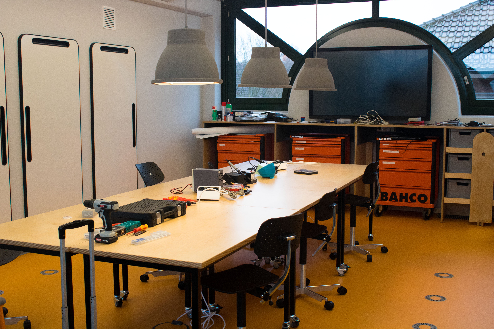

# Tool Rebels im Repair Café

Hey Wera Tool Rebels!

Der Makerspace Gütersloh e.V. ist eine offene Werkstatt, in der Maschinen und Werkzeuge gemeinschaftlich erforscht und genutzt werden. Unter dem Motto »Mach doch, was du willst!« animieren wir Mitglieder, Gäste und interessierte Personen dazu, sich selbst kreativ auszuleben und neue Dinge zu erschaffen. Wir haben verschiedene Kenntnisse, von laienhaft interessiert bis professionell, und unterstützen uns einander bei Projekten, die wir alleine nicht umsetzen könnten.
Wir engagieren uns für eine gesunde Umwelt und veranstalten seit 2019 einmal im Monat ein Repair Café zusammen mit der Stadtbibliothek Gütersloh. Dort unterstützen wir Mitmenschen durch »Hilfe zur Selbsthilfe« bei der Reparatur defekter Haushaltsgegenstände. Neben dem guten Gefühl, anderen geholfen zu haben, lernen wir dabei, Fehler zu finden und kreativ zu beheben.
Wir sehen uns als rebellisch, da wir uns nicht mit dem Status Quo zufriedengeben, Dinge einfach wegzuwerfen, weil sich eine Reparatur nicht "rechnet". Wir schaffen es, gut 50% der von unseren Gästen mitgebrachten Gegenstände ad hoc zu reparieren, weitere 20% schaffen wir bei einem späteren Repair Café und nur 30% können wir nicht reparieren. Dabei wollen wir die Gegenstände nicht nur notdürftig instand setzen, sondern qualitativ hochwertig reparieren, damit sie unseren Gästen lange Freude bereiten und gerne weiter genutzt werden.

Unter dem Projektnamen »GehT weiter!« wollen wir die Werkzeugausstattung für unser Repair Café verbessern. Anfangs hatten wir unsere Vereinsräume ebenfalls in der Stadtbibliothek Gütersloh, sind diesen aber Ende 2019, entwachsen und in das Kulturzentrum »Die Weberei« umgezogen. Seitdem müssen wir für jedes Repair Café Werkzeuge aus unserem Makerspace einpacken und in die Bibliothek transportieren. Vor allem seit die Veranstaltungen nach Corona wieder uneingeschränkt möglich sind, haben wir das als große Motivationsbremse empfunden. Das Einpacken, der Transport und der Aufbau in der Stadtbibliothek dauert ca. 45 Minuten, muss am Ende des Termins noch einmal gemacht werden und wird meistens von den beiden Personen, die das Repair Café organisieren, erledigt. Nicht zuletzt führt der häufige Transport der Werkzeuge immer wieder zu Unordnung in unserer Werkstatt und dazu, dass nicht immer alle Werkzeuge dabei sind.

Daher die konkrete Frage an euch: Würdet ihr uns mit einem oder gar zwei individuell bestückten Werkzeugwagen mit Schraubendrehern, Zangen, Steckschlüsseln, Ringmaulschlüsseln und Schlagwerkzeugen unterstützen, damit wir diese sowohl im Repair Café als auch in unseren Vereinsräumen nutzen können?

Neben einer relativ universellen Ausstattung, um für die unterschiedlichsten Geräte gerüstet zu sein, sind für Reparaturen vor allem Werkzeuge zum Öffnen von Geräten mit langen Klingen und für die unterschiedlichsten Antriebe wichtig.  
https://products.wera.de/de/schraubendreher_kraftform_plus__serie_300_335_350_355_3.html  
https://products.wera.de/de/schraubendreher_kraftform_plus__serie_300_367_4_torx_hf_extra_lang.html  
https://products.wera.de/de/kraftform_kompakt_kraftform_kompakt_60_62_kk_62.html

Als Gegenleistung können wir uns auf verschiedene Weise erkenntlich zeigen.
Zum einen listen wir unterstützende Institutionen auf unserer Website (https://makerspace-gt.de/unterstuetzende/) auf, zum anderen sind wir als gemeinnütziger Verein berechtigt, Spendenbescheinigungen auszustellen, sodass Sach- und Geldspenden steuerlich geltend gemacht werden können.
Nicht zuletzt ist die Präsenz des Werkzeugs bei jedem Repair Café sichtbar und wird von 20 bis 30  Gästen pro Termin wahrgenommen. Wenn kein Repair Café stattfindet, steht der es für alle sichtbar, anstelle eines der bisherigen orangen Werkstattwagen, in einem öffentlichen Bereich der Stadtbibliothek.

Rundum bestimmt ein ein guter Beitrag für eure Tool Rebel Stories (https://www-de.wera.de/de/unternehmen/tool-rebels/) und unsere Website (https://makerspace-gt.de/aktuelles/).

Für Rückfragen und weitere Erläuterungen stehe ich gerne zur Verfügung.

Viele Grüße  
Michael Prange

Makerspace Gütersloh e.V.  
 -- Vorstand --  
c/o Die WEBEREI – Bürgerkiez gGmbH  
Bogenstraße 1-8  
33330 Gütersloh  
Weitere Informationen unter https://makerspace-gt.de

